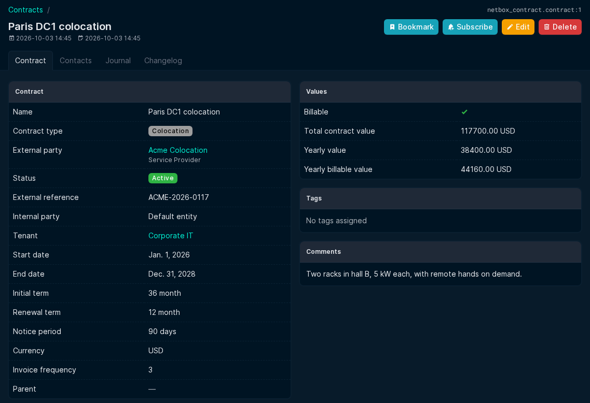
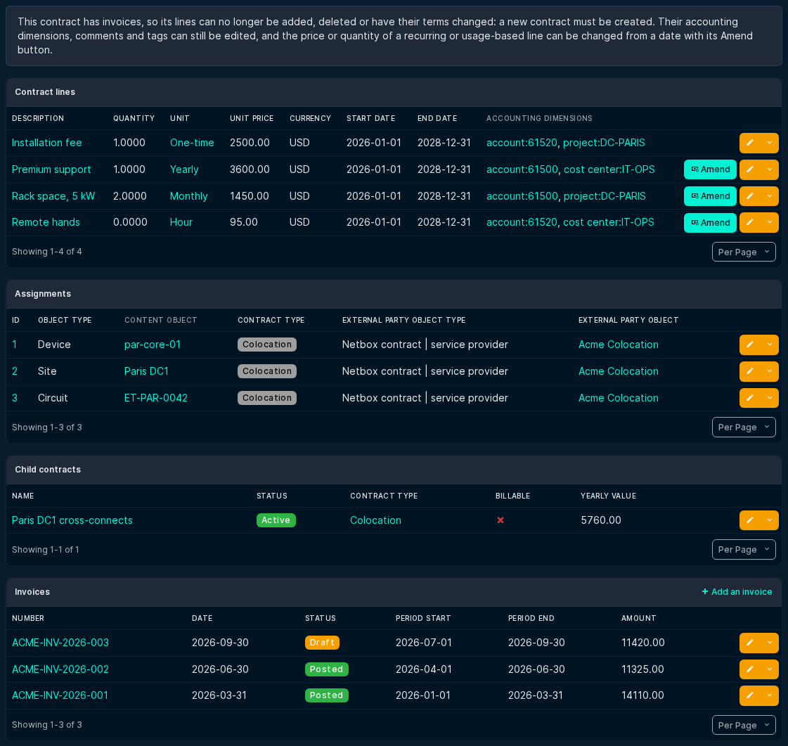

# Contract

## Contract details

- External party type: either an Circuit provider or Contract Service provider.
- Invoice frequency : The number of month that each invoice covers. It is used to propose the period of a new invoice.
- Parent: Contrats can be arranged in a parent / child hierarchie.
- Billable: whether invoices are issued for this contract (default: yes). The lines of a non-billable contract are invoiced through its closest billable parent. The flag cannot change once the contract, one of its parents or one of its children has invoices, or once an invoice line references one of its lines.
- Currency: contract lines and invoices of the contract use the same currency. The currency cannot change once the contract, or one of its non-billable descendants, has invoices (or invoice lines referencing their lines); otherwise its contract lines and its non-billable descendants of the same currency, with their lines, follow the new currency. A non-billable child must have the currency of its parent.
- Deleting a contract deletes its lines and child contracts; it is refused while its lines, or those of its child contracts, are on posted invoices.

What a contract bills for is described by its [contract lines](contract_lines.md).

## Values

The contract page shows values computed from the contract lines:

- Total contract value: the total value of its lines, "Not available" when a recurring line has no end date on an open-ended contract.
- Yearly value: the twelve-month value of its recurring lines.
- Yearly billable value: the yearly value of the lines invoiced under this contract, which are its own lines and those of its non-billable descendants (stopping at any billable child). It is zero for a non-billable contract.

## Contract page

The contract page is built from NetBox's standard panels, like core object pages. Below the contract details and values, it lists the contract's **lines**, **assignments**, **child contracts** (when there are any) and **invoices**. These tables are the tables of the corresponding lists, filtered to the contract: use **Configure Table** on a list (for example the contract line list) to choose the columns shown, and the same choice applies on the contract page. In a contract line table, a locked line offers no Delete button, and a line that can be amended offers **Amend**.

## Deprecated fields

The monthly, yearly and non-recurring cost fields (`mrc`, `yrc`, `nrc`) are replaced by contract lines. The upgrade to version 2.5.0 converts them into contract lines. They are kept, marked as deprecated, and hidden by default in the contract form, detail page and tables; set the plugin setting `show_deprecated_fields` to `True` to show them (on the contract page, in a **Deprecated costs** panel). They stay available in the bulk import and in the REST API.

## Linked objects:  

- Contract lines: the lines of the contract, with a button to add a new one. The buttons are hidden once the contract has invoices.
- Assignments: the assignement of contract to objects is managed from each object's detail view.
- Invoice templates (kept for reference): the deprecated invoice template of the contract, if any. Shown only when the plugin setting `show_deprecated_fields` is `True`; templates remain reachable from the invoice list.
