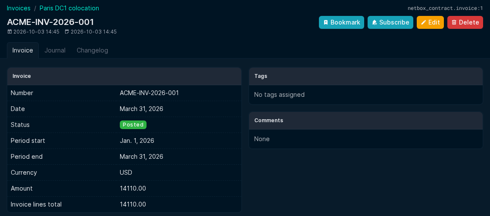
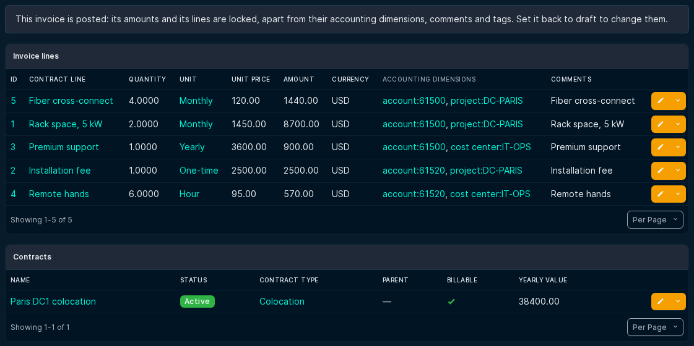

# Invoice

New invoices should be created from the corresponding contract ("Add an invoice" button). A new invoice is linked to one contract, has the currency of that contract, and cannot be created for a non-billable contract (its lines are invoiced through its billable parent).

## Pre-fill

When an invoice is added from a contract, the form proposes:

- the period: it starts the day after the end of the last invoice (or at the contract start date) and covers the contract's invoice frequency;
- the amount, from the contract lines of the contract and of its non-billable descendants:
    - recurring lines: quantity x unit price x months of the period / months of the unit, prorated by days when the line only partly covers the period;
    - one-time lines: quantity x unit price minus the amounts already on posted invoices (draft and canceled invoices are ignored), never below zero;
    - usage-based lines are not proposed: their amount comes from the quantity entered on the invoice line.

When no period can be proposed (a contract without start date and without previous invoice), recurring lines count for one invoice frequency of the contract (for example a monthly line of 100 on a contract invoiced every 3 months gives 300).

Every proposed value can be changed before saving.

## Generated invoice lines

Saving a new invoice creates its [invoice lines](invoice_line.md) from the contract lines, with no other action: one line per applicable contract line of the contract and of its non-billable descendants. Each line references its contract line and carries its accounting dimensions. Recurring lines get the quantity of the contract line, one-time lines the quantity still to invoice, and usage-based lines no quantity (amount 0) until you enter it. The creation is refused when the invoice amount is lower than the total of the lines to generate.

Lines are generated only when an invoice is created (through the web interface or the REST API), never when an existing invoice is edited, and not through the bulk import.

## Fields

- Number: The invoice number. Should correspond to your accounting sysstem invoice number.
- Date: the date of the invoice
- Contracts: The contract linked to the invoice. Invoices linked to several contracts before version 2.5.0 stay as they are and can still be edited, but no contract can be added to them.
- Period_start: The start of the contract periode covered by this invoice.
- Period_end: The end of the contract period covered by this invoice.
- currency: The currency of the invoice, equal to the currency of its contract.
- Amount: The amount of the invoice
- Documents: A link to the corresponding document. This field is deprecated and the document plugin should be used instead.
- Comments: self explanatory.

## Invoice templates (deprecated)

Invoice templates (invoices whose "Template" field is true) are replaced by contract lines. The upgrade to version 2.5.0 converts each template into contract lines. Templates are kept for reference and never deleted; they are shown with a "deprecated" badge and are no longer used to pre-fill or to create invoice lines. New templates can only be created when the plugin setting `show_deprecated_fields` is `True`.

Linked objects:  

