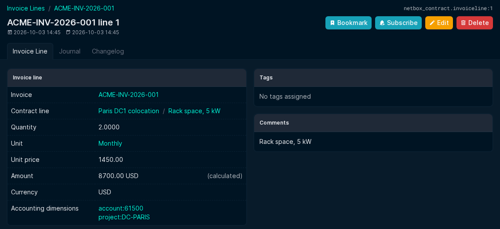

# Invoice line

An invoice line correspond to the accouning lines for the invoice.
You can define several accounting lines for an invoice but the sum of each line amount cannot exceed the invoice amount. This is enforced in the web interface and the REST API; once a usage quantity is entered, raise the invoice amount if needed.

- Invoice: The corresponding invoice.
- Contract line: the contract line the invoice line comes from (optional). It must belong to the contract of the invoice or to one of its non-billable descendants.
- Unit and unit price: default to those of the contract line and can be changed on the line, for example to grant a discount on one invoice; the contract line is not changed. A line without contract line can have them too.
- Quantity: the quantity invoiced.
- Unit and unit price: taken from the contract line (read-only).
- Currency: the currency of the invoice.
- Amount: calculated from the quantity and the unit price when the line has a unit price (quantity x unit price for one-time and usage-based units; for recurring units, prorated to the invoice period as for the [invoice pre-fill](invoice.md#pre-fill), or counted for one invoice frequency of the contract when the invoice has no period). It is recalculated each time the line is saved, so change the invoice period before editing its lines. Without a unit price, the amount is entered manually. Whether you take into account VAT in this amount depends on the way your budget is contructed.
- Accounting dimensions: The accounting dimensions for the invoice line, copied from the contract line when the line is generated.
- Comments: Self explanatory
